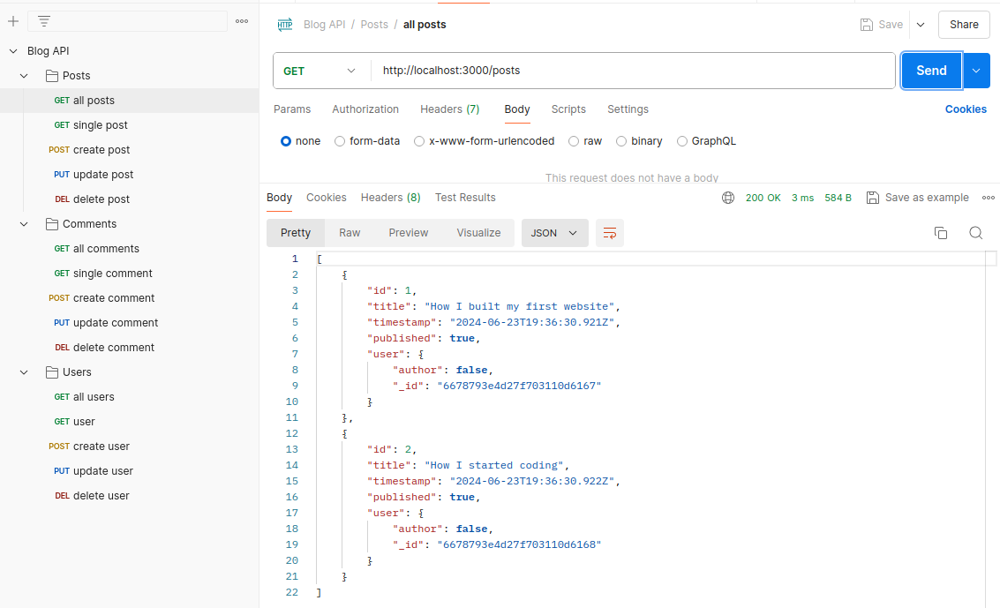

# Blog - API

With this project I have practiced:

- API endpoints with Postman
  - keep related api endpoints together for easier navigation and management
  - facilitate clear API documentation by grouping endpoints logically within folders
  - great collaboration in a team

